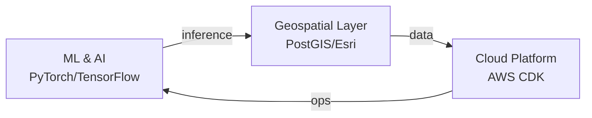

## Bishal Dhungana
**Geospatial Data Scientist** | Enterprise Data Platforms | AI/ML Systems

**[Portfolio](https://dbishal13.github.io)** · **[LinkedIn](https://www.linkedin.com/in/dbishal)**

## What I Build
**ML & Computer Vision** | LiDAR processing, ONNX inference, production pipelines  
**Geospatial Systems** | PostGIS, GIS applications, spatial analytics at scale  
**Cloud Infrastructure** | AWS CDK, microservices, enterprise platforms

## Featured Projects
| **[geospatial-data-copilot](https://github.com/DBishal13/geospatial-data-copilot)** | AI-powered geospatial platform |
| **[pywmp](https://github.com/DBishal13/pywmp)** | Watershed management GIS stack |
| **[GEOG](https://github.com/DBishal13/GEOG)** | Spatial analysis package |
| **[Lidar-Products-USGS3DEP](https://github.com/DBishal13/Lidar-Products-USGS3DEP)** | LiDAR processing & viz |

## Architecture

## Tech
**Languages:** Python, SQL, TypeScript | **ML:** PyTorch, TensorFlow, PDAL | **Cloud:** AWS, Docker, K8s | **Geo:** PostGIS, Esri