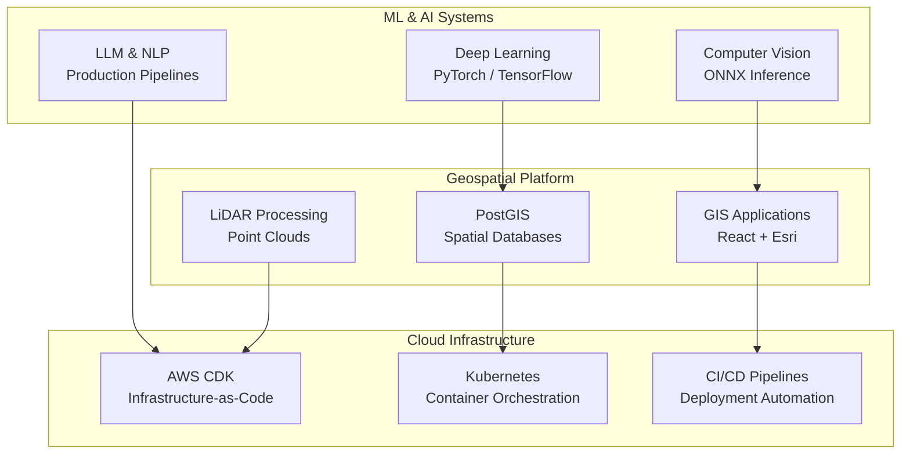

## AI & Geospatial Data Scientist  
**Enterprise Data Platform Engineer** | **ML Ops** | **Cloud Infrastructure**

> Building production-grade AI/ML and geospatial systems for power grid intelligence and enterprise-scale data integration.

**[Portfolio](https://dbishal13.github.io)** · **[LinkedIn](https://www.linkedin.com/in/dbishal)** · **[GitHub](https://github.com/DBishal13)**

---

<div align="center">

```
╔═══════════════════════════════════════════════════════════════╗
║                                                               ║
║     🌍 Geospatial AI | 🤖 ML Ops | ☁️  Cloud Systems         ║
║                                                               ║
║   Building Intelligence from Spatial Data at Enterprise Scale ║
║                                                               ║
╚═══════════════════════════════════════════════════════════════╝
```

</div>

---

<div align="center">


</div>

---

## 🏗️ Architecture & Expertise



---

## 🚀 Featured Projects

<div align="center">

### ML & AI Platforms
```
┏━━━━━━━━━━━━━━━━━━━━━━━━━━━━━━━━━━━━━━━━━━━━━━━┓
┃  🤖 geospatial-data-copilot                  ┃
┃  AI-powered geospatial intelligence platform  ┃
┃  [Python] [ML] [Geospatial] [Data]           ┃
┗━━━━━━━━━━━━━━━━━━━━━━━━━━━━━━━━━━━━━━━━━━━━━━━┛

┏━━━━━━━━━━━━━━━━━━━━━━━━━━━━━━━━━━━━━━━━━━━━━━━┓
┃  🗣️  conversational-ai-assistant              ┃
┃  Production LLM application                   ┃
┃  [Python] [AI] [NLP] [LLM]                    ┃
┗━━━━━━━━━━━━━━━━━━━━━━━━━━━━━━━━━━━━━━━━━━━━━━━┛
```

### Geospatial Engineering
```
┏━━━━━━━━━━━━━━━━━━━━━━━━━━━━━━━━━━━━━━━━━━━━━━━┓
┃  🗺️  pywmp                                     ┃
┃  Watershed management platform with GIS stack ┃
┃  [Python] [GIS] [Esri] [PostGIS]              ┃
┗━━━━━━━━━━━━━━━━━━━━━━━━━━━━━━━━━━━━━━━━━━━━━━━┛

┏━━━━━━━━━━━━━━━━━━━━━━━━━━━━━━━━━━━━━━━━━━━━━━━┓
┃  📦 GEOG                                       ┃
┃  Reusable geospatial analysis package          ┃
┃  [Python] [PostGIS] [Analysis]                 ┃
┗━━━━━━━━━━━━━━━━━━━━━━━━━━━━━━━━━━━━━━━━━━━━━━━┛

┏━━━━━━━━━━━━━━━━━━━━━━━━━━━━━━━━━━━━━━━━━━━━━━━┓
┃  ⛰️  Lidar-Products-USGS3DEP                    ┃
┃  LiDAR processing & 3D visualization           ┃
┃  [Python] [LiDAR] [Point-Cloud]                ┃
┗━━━━━━━━━━━━━━━━━━━━━━━━━━━━━━━━━━━━━━━━━━━━━━━┛
```

### Data & Analytics Infrastructure
```
┏━━━━━━━━━━━━━━━━━━━━━━━━━━━━━━━━━━━━━━━━━━━━━━━┓
┃  📈 Air-Pollution-in-Florida                   ┃
┃  Environmental monitoring with dashboards      ┃
┃  [Dashboard] [Data Viz] [Python]               ┃
┗━━━━━━━━━━━━━━━━━━━━━━━━━━━━━━━━━━━━━━━━━━━━━━━┛

┏━━━━━━━━━━━━━━━━━━━━━━━━━━━━━━━━━━━━━━━━━━━━━━━┓
┃  🚌 GTFS_BrowardCounty                         ┃
┃  Public transportation data engineering        ┃
┃  [GIS] [Data Engineering] [Analytics]          ┃
┗━━━━━━━━━━━━━━━━━━━━━━━━━━━━━━━━━━━━━━━━━━━━━━━┛

┏━━━━━━━━━━━━━━━━━━━━━━━━━━━━━━━━━━━━━━━━━━━━━━━┓
┃  🌾 AgriculturalSuitability                     ┃
┃  Spatial analysis for land suitability          ┃
┃  [GIS] [Spatial Analysis] [Python]              ┃
┗━━━━━━━━━━━━━━━━━━━━━━━━━━━━━━━━━━━━━━━━━━━━━━━┛
```

</div>

---

## 💻 Tech Stack

```yaml
┌─────────────────────────────────────────────────────────┐
│ LANGUAGES                                               │
├─────────────────────────────────────────────────────────┤
│ • Python (primary) | SQL & PostGIS | TypeScript | Shell │
└─────────────────────────────────────────────────────────┘

┌─────────────────────────────────────────────────────────┐
│ ML & DATA                                               │
├─────────────────────────────────────────────────────────┤
│ • PyTorch / TensorFlow (deep learning)                  │
│ • PDAL (point cloud processing)                         │
│ • DuckDB / Pandas (data processing)                     │
│ • Scikit-learn (classical ML)                           │
└─────────────────────────────────────────────────────────┘

┌─────────────────────────────────────────────────────────┐
│ CLOUD & DEVOPS                                          │
├─────────────────────────────────────────────────────────┤
│ • AWS (CDK, Lambda, SageMaker, EC2, ECS, S3)            │
│ • Docker & Kubernetes                                  │
│ • CI/CD pipelines & GitOps                              │
│ • Infrastructure-as-Code                                │
└─────────────────────────────────────────────────────────┘

┌─────────────────────────────────────────────────────────┐
│ FRONTEND & VISUALIZATION                                │
├─────────────────────────────────────────────────────────┤
│ • React + Vite (TypeScript)                             │
│ • ArcGIS / Esri                                         │
│ • Jupyter Notebooks                                     │
│ • Plotly / Folium                                       │
└─────────────────────────────────────────────────────────┘

┌─────────────────────────────────────────────────────────┐
│ GEOSPATIAL                                              │
├─────────────────────────────────────────────────────────┤
│ • PostGIS & QGIS                                        │
│ • GeoPandas & Shapely                                   │
│ • Rasterio & Fiona                                      │
│ • Leaflet & Folium                                      │
└─────────────────────────────────────────────────────────┘
```

---

## 📬 Connect

<div align="center">

[](https://dbishal13.github.io)
[](https://www.linkedin.com/in/dbishal)
[](https://github.com/DBishal13)

**Interested in:** Enterprise platforms · Geospatial AI · ML ops · Cloud infrastructure · Open source

```
🌍 Building intelligence from spatial data at enterprise scale
```

</div>