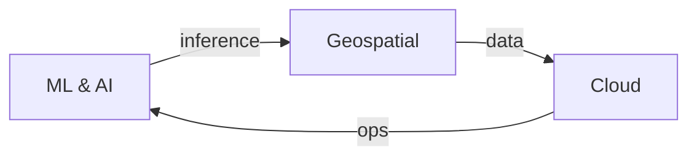

## Bishal Dhungana
**Geospatial Data Scientist** | Enterprise Data Platforms | AI/ML Systems

     

 

**ML & Computer Vision** | LiDAR, ONNX inference, production pipelines · **Geospatial** | PostGIS, GIS apps, spatial analytics · **Cloud** | AWS CDK, microservices, enterprise platforms

**Projects:** [geospatial-data-copilot](https://github.com/DBishal13/geospatial-data-copilot) | [pywmp](https://github.com/DBishal13/pywmp) | [GEOG](https://github.com/DBishal13/GEOG) | [Lidar-Products-USGS3DEP](https://github.com/DBishal13/Lidar-Products-USGS3DEP)

**Languages:** Python, SQL, TypeScript · **ML:** PyTorch, TensorFlow, PDAL · **Cloud:** AWS, Docker, K8s · **Geo:** PostGIS, Esri