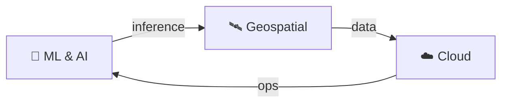

<picture>
  
</picture>

## ⚡ About Me

- 🛰️ **Geospatial Data Scientist** turning LiDAR, satellite, and hazard data into decision-ready intelligence
- 🤖 Building **agentic AI systems** — LLM copilots and MCP servers over spatial & hazard APIs
- ☁️ Designing **enterprise data platforms** on AWS — CDK, microservices, PostGIS at scale
- 🧠 Deep in **computer vision & inference** — ONNX pipelines, PDAL, production-grade CV
- 🌱 Currently shipping: agentic geospatial copilots and real-time hazard-exposure pipelines

```mermaid
graph LR
    A["🤖 ML & AI"] -->|inference| B["🛰️ Geospatial"]
    B -->|data| C["☁️ Cloud"]
    C -->|ops| A
```

## 🛠️ Tech Stack

&nbsp;&nbsp;

&nbsp;&nbsp;

&nbsp;&nbsp;

## 📊 GitHub Stats

## 🚀 Featured Projects

| Project | Description |
|---|---|
| [**geospatial-data-copilot**](https://github.com/DBishal13/geospatial-data-copilot) | Natural-language interface over spatial/infrastructure data — an LLM agent turns plain-English questions into spatial SQL, runs them, and answers with an interactive map. |
| [**hazard-mcp**](https://github.com/DBishal13/hazard-mcp) | An MCP server unifying FEMA, USGS, NOAA, NWS, and NASA hazard APIs behind a single agent-facing interface. |
| [**gtfs-transit-platform**](https://github.com/DBishal13/gtfs-transit-platform) | Data-engineering + geospatial-analytics platform for GTFS transit feeds, with an interactive map app deployed to GitHub Pages. |
| [**surge-exposure**](https://github.com/DBishal13/surge-exposure) | Pipeline overlaying NOAA storm-surge and flood layers against building footprints to score infrastructure exposure. |
| [**3DEP-Lidar-Terrain-Builder**](https://github.com/DBishal13/3DEP-Lidar-Terrain-Builder) | Generates DEM, DSM, hillshade, slope, aspect, and contour products from USGS 3DEP lidar for any AOI. |
| [**conversational-ai-assistant**](https://github.com/DBishal13/conversational-ai-assistant) | LangChain RAG chatbot grounding multi-turn answers in a local Chroma vector store, with source citations. |

## 🐍 Contribution Snake

<picture>
  <source media="(prefers-color-scheme: dark)" srcset="https://raw.githubusercontent.com/DBishal13/dbishal13/output/github-contribution-grid-snake-dark.svg" />
  <source media="(prefers-color-scheme: light)" srcset="https://raw.githubusercontent.com/DBishal13/dbishal13/output/github-contribution-grid-snake.svg" />
  
</picture>

<picture>
  
</picture>
