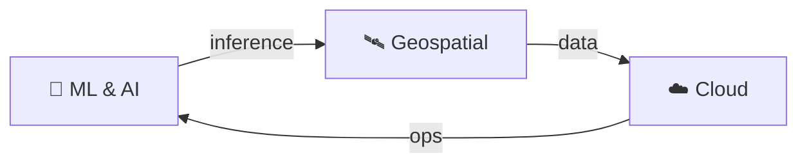

<picture>
  
</picture>

## ⚡ About Me

- 🛰️ **Geospatial Data Scientist** turning LiDAR, satellite, and hazard data into decision-ready intelligence
- 🤖 Building **agentic AI systems** — LLM copilots and MCP servers over spatial & hazard APIs
- ☁️ Designing **enterprise data platforms** on AWS — CDK, microservices, PostGIS at scale
- 🧠 Deep in **computer vision & inference** — ONNX pipelines, PDAL, production-grade CV
- 🌱 Currently shipping: agentic geospatial copilots and real-time hazard-exposure pipelines

```mermaid
graph LR
    A["🤖 ML & AI"] -->|inference| B["🛰️ Geospatial"]
    B -->|data| C["☁️ Cloud"]
    C -->|ops| A
```

## 🛠️ Tech Stack

&nbsp;&nbsp;

&nbsp;&nbsp;

&nbsp;&nbsp;

## 📊 GitHub Stats

<!--
The main stats card, top-langs card, and trophy image (github-readme-stats.vercel.app
and github-profile-trophy.vercel.app) are removed for now — both shared demo
deployments are down (DEPLOYMENT_PAUSED / DEPLOYMENT_DISABLED as of 2026-08-24),
which is an outage on the maintainers' free Vercel hosting, not specific to this
profile. Re-add them if/when those come back, or switch to a self-hosted fork:
https://github.com/anuraghazra/github-readme-stats#deploy-on-your-own
-->

## 🚀 Featured Projects

_Auto-updated daily from my most recently active repos — see [update-projects.yml](.github/workflows/update-projects.yml)._

<!-- FEATURED-PROJECTS:START -->
| Project | Description |
|---|---|
| [**SurgeExposure**](https://github.com/DBishal13/surge-exposure) | A cloud-native pipeline overlaying NOAA storm-surge and flood-inundation data against Overture Maps building footprints, scoring per-asset flood exposure across 8 coastal regions — with a map and API. |
| [**fflood-nep**](https://github.com/DBishal13/fflood-nep) | A reproducible flood-response pipeline for Nepal's August 2026 Rasuwa/Bhote Koshi flash flood — runs Sentinel-1 SAR change detection for flood extent, scores building/road/facility exposure by munici… |
| [**wildfire-copilot**](https://github.com/DBishal13/wildfire-copilot) | A LangGraph agent for utility wildfire risk — combines a trained XGBoost susceptibility model with live NASA/NWS hazard feeds and RAG over real wildfire-mitigation filings to answer plain-English ris… |
| [**geomlint**](https://github.com/DBishal13/geomlint) | A CI-first data-quality linter for vector geospatial files — catches invalid geometry, CRS confusion, and topology errors that mainstream data-observability tools skip. No GDAL required; pip install… |
| [**Geospatial Data Copilot**](https://github.com/DBishal13/geospatial-data-copilot) | Ask a plain-English question about San Francisco's utility infrastructure — a local LLM agent (LangGraph ReAct, Ollama) translates it to spatial SQL, runs it, and answers with a summary and interacti… |
| [**HazardMCP**](https://github.com/DBishal13/hazard-mcp) | An MCP server unifying FEMA, USGS, NOAA, NWS, and NASA hazard data behind a single AI-agent interface — one-call location risk summaries and map rendering, compatible with Claude Desktop. |
<!-- FEATURED-PROJECTS:END -->

## 🐍 Contribution Snake

<picture>
  <source media="(prefers-color-scheme: dark)" srcset="https://raw.githubusercontent.com/DBishal13/dbishal13/output/github-contribution-grid-snake-dark.svg" />
  <source media="(prefers-color-scheme: light)" srcset="https://raw.githubusercontent.com/DBishal13/dbishal13/output/github-contribution-grid-snake.svg" />
  
</picture>

<picture>
  
</picture>
